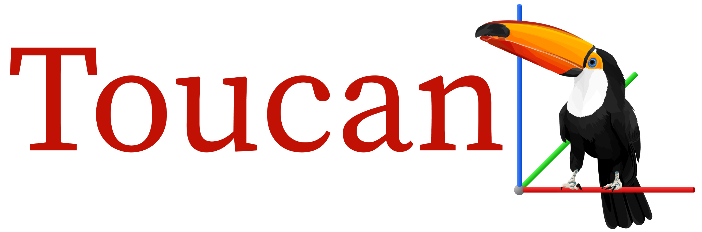
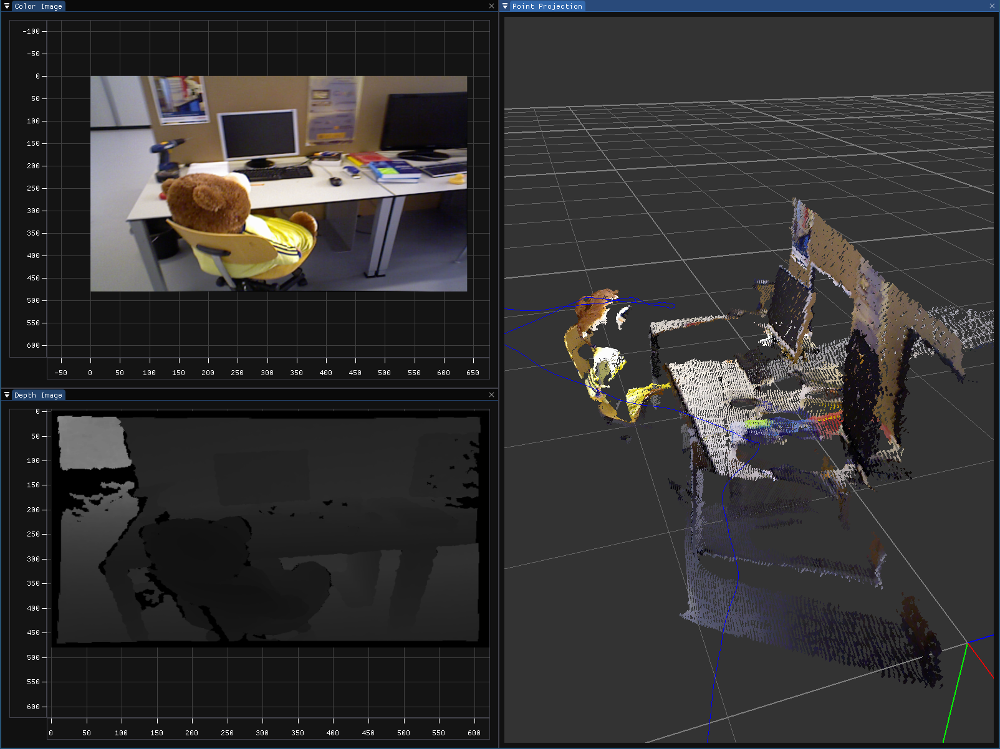

[](http://choosealicense.com/licenses/mit/)

Toucan is an interactive visualization library written in C++, primarily aimed at computer vision and robotics.

## Project Status
The project is currently in an early stage. Therefore, the library is likely to contain bugs, and the API may change between versions. 

## Installation
Install dependencies:
```shell script
sudo apt update
sudo apt install cmake libglfw3 libglfw3-dev
```
Install Toucan:
```shell script
git clone --recurse-submodules git@github.com:matiasvc/Toucan.git
cd Toucan
mkdir build && cd build
cmake ..
make -j4 # Replace 4 with the number of cpu cores
sudo make install
```

## Screenshots



## Similar Projects

- [vdb - visual debugger](https://github.com/lightbits/vdb)
- [Pangolin](https://github.com/stevenlovegrove/Pangolin)
